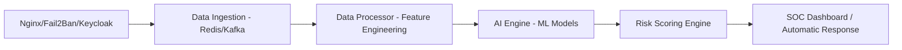

# Nexus ZT — Architecture Intelligence Artificielle (AIA)

Ce document décrit l'intégration du moteur d'IA avancé pour la plateforme SOC Zero Trust.

## 1. Vue d'ensemble

L'AIA (AI Architecture) repose sur une approche hybride :
- **UEBA (User & Entity Behavior Analytics)** pour la détection d'anomalies inconnues.
- **IDS Supervisé** pour la reconnaissance d'attaques connues (Brute Force, Scans).
- **Orchestration SOAR** pour la réponse automatique.

## 2. Pipeline de Données

## 3. Modèles Machine Learning

### A. Détection d'Anomalies (Non-Supervisé)
- **Isolation Forest** : Détection des connexions aberrantes (horaires insolites, localisations distantes).
- **Autoencoder** : Reconstitution du profil utilisateur pour identifier les déviations de comportement.

### B. Classification d'Attaques (Supervisé)
- **Random Forest / XGBoost** : Entraîné sur des datasets type CIDDS-001 / NSL-KDD pour identifier :
    - Brute Force (Logins rapides échoués)
    - Network Scans (Requêtes sur plusieurs ports)
    - mTLS bypass attempts

## 4. Stratégie de Réponse Automatique (SOAR)

| Score de Risque | Action Auto | Notification |
| :--- | :--- | :--- |
| **0 - 40** | Aucune | Log INFO |
| **40 - 60** | Observation renforcée | Alerte SOC (Low) |
| **60 - 80** | **MFA Obligatoire** | Alerte SOC (Med) |
| **80 - 100** | **Bannissement IP / Révocation Certificat** | Alerte Critique (High) |

## 5. Composants Infrastructure

- **ai-engine** : Service FastAPI python gérant l'inference ML.
- **data-processor** : Script de transformation des logs bruts en vecteurs de caractéristiques.
- **Elasticsearch** : Stockage et indexation des événements de sécurité.
- **SOC Frontend** : Visualisation via Recharts/D3.
